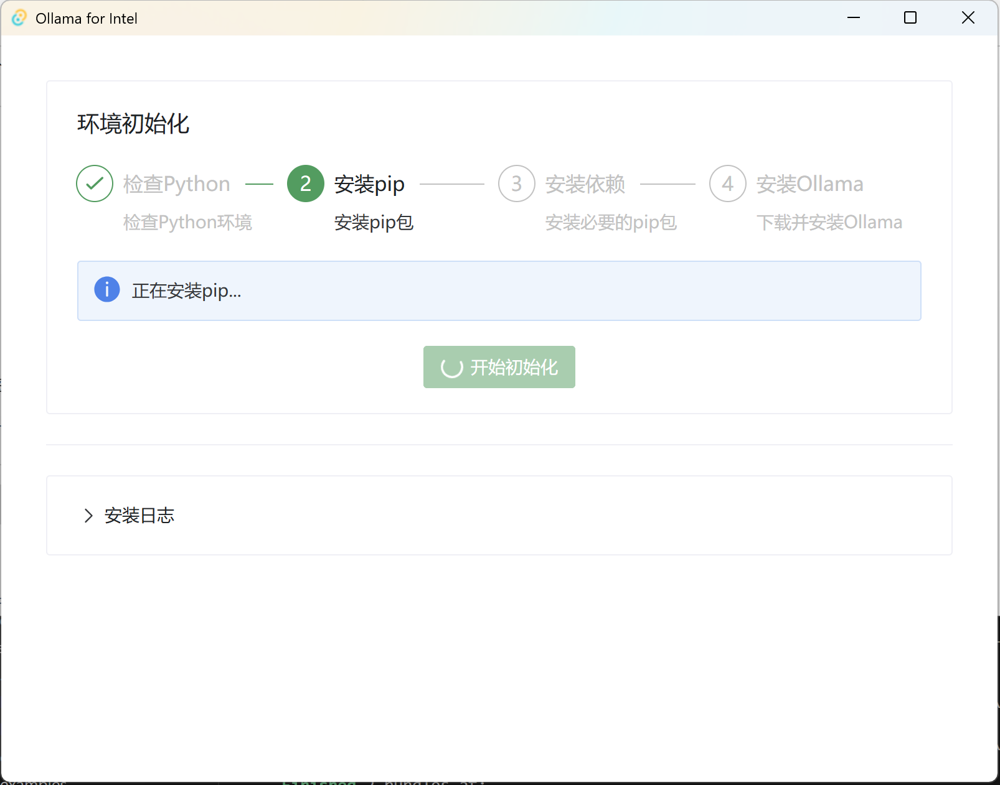

# Ollama for Intel
Rust + Tauri + Vue + NaiveUI

## 工具简介
olltel 封装了Intel官方提供的AI推理工具包，并将其与Ollama服务相结合。通过图形化界面，用户可以轻松完成从环境配置到模型部署的整个流程。目前该工具仅支持多种Intel Arc显卡架构（不包括B系列）。
## 安装
### 驱动更新
请确保你的 GPU 驱动程序版本不低于 31.0.101.5522。 如果版本较低，从 [Intel 官方下载页面](https://www.intel.com/content/www/us/en/download/785597/intel-arc-iris-xe-graphics-windows.html) 下载并安装最新的 GPU 驱动程序，否则可能会遇到输出乱码的问题。
### 工具安装
- 请从 release 查找下载文件
- 双击安装文件根据指引安装软件
## 使用
初次使用需要初始化环境，该步骤可能需要代理

环境设置成功后跳转到Ollama 控制页面，可以在此处启动或关闭Ollama服务。如需使用 `ollama` 命令请点击 **打开CMD**或**打开powershell** 按钮。在命令行中使用。

## 后续
可以根据个人喜好搭配其他大语言模型前端工具，例如：[Lobe Chat](https://chat-preview.lobehub.com/)、[AnythingLLM](https://anythingllm.com/)、[Chatbox AI](https://chatboxai.app/zh)、[Open WebUI](https://docs.openwebui.com/)。
参考教程：[五个优秀的免费 Ollama WebUI 客户端推荐](https://lobehub.com/zh/blog/5-ollama-web-ui-recommendation)

## 意见反馈
如有问题，欢迎提交issues。

---
参考资料：[在 Intel GPU 上使用 IPEX-LLM 运行 Ollama](https://github.com/intel/ipex-llm/blob/main/docs/mddocs/Quickstart/ollama_quickstart.zh-CN.md)
